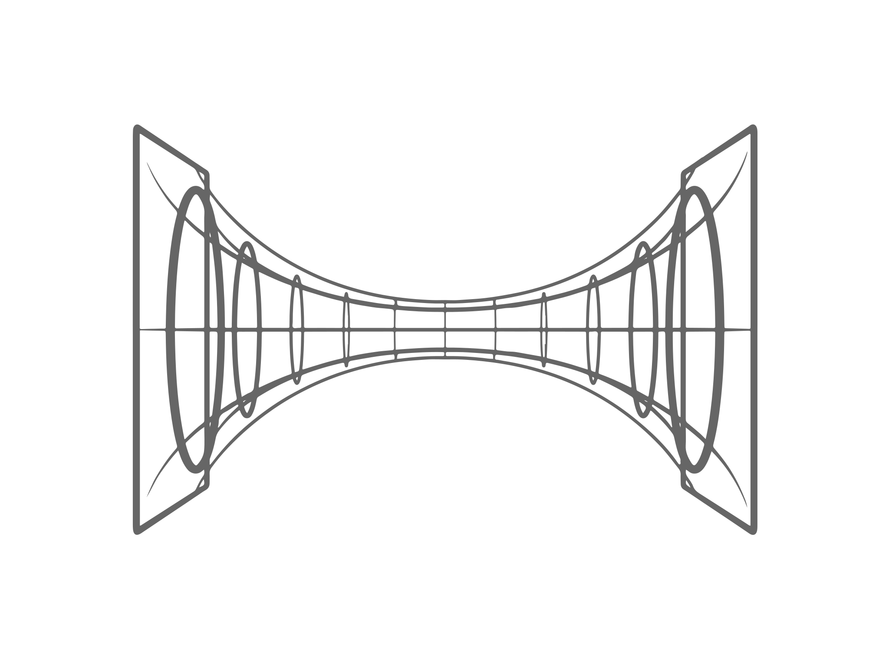

|logo| ``tractor``: next-gen Python parallelism

|gh_actions|
|docs|

``tractor`` is a `structured concurrent`_, multi-processing_ runtime
built on trio_.

Fundamentally ``tractor`` gives you parallelism via ``trio``-"*actors*":
our nurseries_ let you spawn new Python processes which each run a ``trio``
scheduled runtime - a call to ``trio.run()``.

We believe the system adheres to the `3 axioms`_ of an "`actor model`_"
but likely *does not* look like what *you* probably think an "actor
model" looks like, and that's *intentional*.

The first step to grok ``tractor`` is to get the basics of ``trio`` down.
A great place to start is the `trio docs`_ and this `blog post`_.

Features
--------
- **It's just** a ``trio`` API
- *Infinitely nesteable* process trees
- Builtin IPC streaming APIs with task fan-out broadcasting
- A (first ever?) "native" multi-core debugger UX for Python using `pdb++`_
- Support for a swappable, OS specific, process spawning layer
- A modular transport stack, allowing for custom serialization (eg. with
  `msgspec`_), communications protocols, and environment specific IPC
  primitives
- Support for spawning process-level-SC, inter-loop one-to-one-task oriented
  ``asyncio`` actors via "infected ``asyncio``" mode
- `structured chadcurrency`_ from the ground up

Run a func in a process
-----------------------
Use ``trio``'s style of focussing on *tasks as functions*:

.. code:: python

    """
    Run with a process monitor from a terminal using::

        $TERM -e watch -n 0.1  "pstree -a $$" \
            & python examples/parallelism/single_func.py \
            && kill $!

    """
    import os

    import tractor
    import trio

    async def burn_cpu():

        pid = os.getpid()

        # burn a core @ ~ 50kHz
        for _ in range(50000):
            await trio.sleep(1/50000/50)

        return os.getpid()

    async def main():

        async with tractor.open_nursery() as n:

            portal = await n.run_in_actor(burn_cpu)

            #  burn rubber in the parent too
            await burn_cpu()

            # wait on result from target function
            pid = await portal.result()

        # end of nursery block
        print(f"Collected subproc {pid}")

    if __name__ == '__main__':
        trio.run(main)

This runs ``burn_cpu()`` in a new process and reaps it on completion
of the nursery block.

If you only need to run a sync function and retreive a single result, you
might want to check out `trio-parallel`_.

Zombie safe: self-destruct a process tree
-----------------------------------------
``tractor`` tries to protect you from zombies, no matter what.

.. code:: python

    """
    Run with a process monitor from a terminal using::

        $TERM -e watch -n 0.1  "pstree -a $$" \
            & python examples/parallelism/we_are_processes.py \
            && kill $!

    """
    from multiprocessing import cpu_count
    import os

    import tractor
    import trio

    async def target():
        print(
            f"Yo, i'm '{tractor.current_actor().name}' "
            f"running in pid {os.getpid()}"
        )

       await trio.sleep_forever()

    async def main():

        async with tractor.open_nursery() as n:

            for i in range(cpu_count()):
                await n.run_in_actor(target, name=f'worker_{i}')

            print('This process tree will self-destruct in 1 sec...')
            await trio.sleep(1)

            # raise an error in root actor/process and trigger
            # reaping of all minions
            raise Exception('Self Destructed')

    if __name__ == '__main__':
        try:
            trio.run(main)
        except Exception:
            print('Zombies Contained')

If you can create zombie child processes (without using a system signal)
it **is a bug**.

"Native" multi-process debugging
--------------------------------
Using the magic of `pdb++`_ and our internal IPC, we've
been able to create a native feeling debugging experience for
any (sub-)process in your ``tractor`` tree.

.. code:: python

    from os import getpid

    import tractor
    import trio

    async def breakpoint_forever():
        "Indefinitely re-enter debugger in child actor."
        while True:
            yield 'yo'
            await tractor.breakpoint()

    async def name_error():
        "Raise a ``NameError``"
        getattr(doggypants)

    async def main():
        """Test breakpoint in a streaming actor.
        """
        async with tractor.open_nursery(
            debug_mode=True,
            loglevel='error',
        ) as n:

            p0 = await n.start_actor('bp_forever', enable_modules=[__name__])
            p1 = await n.start_actor('name_error', enable_modules=[__name__])

            # retreive results
            stream = await p0.run(breakpoint_forever)
            await p1.run(name_error)

    if __name__ == '__main__':
        trio.run(main)

You can run this with::

    >>> python examples/debugging/multi_daemon_subactors.py

And, yes, there's a built-in crash handling mode B)

We're hoping to add a respawn-from-repl system soon!

SC compatible bi-directional streaming
--------------------------------------
Yes, you saw it here first; we provide 2-way streams
with reliable, transitive setup/teardown semantics.

Our nascent api is remniscent of ``trio.Nursery.start()``
style invocation:

.. code:: python

    import trio
    import tractor

    @tractor.context
    async def simple_rpc(

        ctx: tractor.Context,
        data: int,

    ) -> None:
        '''Test a small ping-pong 2-way streaming server.

        '''
        # signal to parent that we're up much like
        # ``trio_typing.TaskStatus.started()``
        await ctx.started(data + 1)

        async with ctx.open_stream() as stream:

            count = 0
            async for msg in stream:

                assert msg == 'ping'
                await stream.send('pong')
                count += 1

            else:
                assert count == 10

    async def main() -> None:

        async with tractor.open_nursery() as n:

            portal = await n.start_actor(
                'rpc_server',
                enable_modules=[__name__],
            )

            # XXX: this syntax requires py3.9
            async with (

                portal.open_context(
                    simple_rpc,
                    data=10,
                ) as (ctx, sent),

                ctx.open_stream() as stream,
            ):

                assert sent == 11

                count = 0
                # receive msgs using async for style
                await stream.send('ping')

                async for msg in stream:
                    assert msg == 'pong'
                    await stream.send('ping')
                    count += 1

                    if count >= 9:
                        break

            # explicitly teardown the daemon-actor
            await portal.cancel_actor()

    if __name__ == '__main__':
        trio.run(main)

See original proposal and discussion in `#53`_ as well
as follow up improvements in `#223`_ that we'd love to
hear your thoughts on!

.. _#53: https://github.com/goodboy/tractor/issues/53
.. _#223: https://github.com/goodboy/tractor/issues/223

Worker poolz are easy peasy
---------------------------
The initial ask from most new users is *"how do I make a worker
pool thing?"*.

``tractor`` is built to handle any SC (structured concurrent) process
tree you can imagine; a "worker pool" pattern is a trivial special
case.

We have a `full worker pool re-implementation`_ of the std-lib's
``concurrent.futures.ProcessPoolExecutor`` example for reference.

You can run it like so (from this dir) to see the process tree in
real time::

    $TERM -e watch -n 0.1  "pstree -a $$" \
        & python examples/parallelism/concurrent_actors_primes.py \
        && kill $!

This uses no extra threads, fancy semaphores or futures; all we need
is ``tractor``'s IPC!

"Infected ``asyncio``" mode
---------------------------
Have a bunch of ``asyncio`` code you want to force to be SC at the process level?

Check out our experimental system for `guest-mode`_ controlled
``asyncio`` actors:

.. code:: python

    import asyncio
    from statistics import mean
    import time

    import trio
    import tractor

    async def aio_echo_server(
        to_trio: trio.MemorySendChannel,
        from_trio: asyncio.Queue,
    ) -> None:

        # a first message must be sent **from** this ``asyncio``
        # task or the ``trio`` side will never unblock from
        # ``tractor.to_asyncio.open_channel_from():``
        to_trio.send_nowait('start')

        # XXX: this uses an ``from_trio: asyncio.Queue`` currently but we
        # should probably offer something better.
        while True:
            # echo the msg back
            to_trio.send_nowait(await from_trio.get())
            await asyncio.sleep(0)

    @tractor.context
    async def trio_to_aio_echo_server(
        ctx: tractor.Context,
    ):
        # this will block until the ``asyncio`` task sends a "first"
        # message.
        async with tractor.to_asyncio.open_channel_from(
            aio_echo_server,
        ) as (first, chan):

            assert first == 'start'
            await ctx.started(first)

            async with ctx.open_stream() as stream:

                async for msg in stream:
                    await chan.send(msg)

                    out = await chan.receive()
                    # echo back to parent actor-task
                    await stream.send(out)

    async def main():

        async with tractor.open_nursery() as n:
            p = await n.start_actor(
                'aio_server',
                enable_modules=[__name__],
                infect_asyncio=True,
            )
            async with p.open_context(
                trio_to_aio_echo_server,
            ) as (ctx, first):

                assert first == 'start'

                count = 0
                async with ctx.open_stream() as stream:

                    delays = []
                    send = time.time()

                    await stream.send(count)
                    async for msg in stream:
                        recv = time.time()
                        delays.append(recv - send)
                        assert msg == count
                        count += 1
                        send = time.time()
                        await stream.send(count)

                        if count >= 1e3:
                            break

            print(f'mean round trip rate (Hz): {1/mean(delays)}')
            await p.cancel_actor()

    if __name__ == '__main__':
        trio.run(main)

Yes, we spawn a python process, run ``asyncio``, start ``trio`` on the
``asyncio`` loop, then send commands to the ``trio`` scheduled tasks to
tell ``asyncio`` tasks what to do XD

We need help refining the `asyncio`-side channel API to be more
`trio`-like. Feel free to sling your opinion in `#273`_!

.. _#273: https://github.com/goodboy/tractor/issues/273

Higher level "cluster" APIs
---------------------------
To be extra terse the ``tractor`` devs have started hacking some "higher
level" APIs for managing actor trees/clusters. These interfaces should
generally be condsidered provisional for now but we encourage you to try
them and provide feedback. Here's a new API that let's you quickly
spawn a flat cluster:

.. code:: python

    import trio
    import tractor

    async def sleepy_jane():
        uid = tractor.current_actor().uid
        print(f'Yo i am actor {uid}')
        await trio.sleep_forever()

    async def main():
        '''
        Spawn a flat actor cluster, with one process per
        detected core.

        '''
        portal_map: dict[str, tractor.Portal]
        results: dict[str, str]

        # look at this hip new syntax!
        async with (

            tractor.open_actor_cluster(
                modules=[__name__]
            ) as portal_map,

            trio.open_nursery() as n,
        ):

            for (name, portal) in portal_map.items():
                n.start_soon(portal.run, sleepy_jane)

            await trio.sleep(0.5)

            # kill the cluster with a cancel
            raise KeyboardInterrupt

    if __name__ == '__main__':
        try:
            trio.run(main)
        except KeyboardInterrupt:
            pass

.. _full worker pool re-implementation: https://github.com/goodboy/tractor/blob/master/examples/parallelism/concurrent_actors_primes.py

Install
-------
From PyPi::

    pip install tractor

From git::

    pip install git+git://github.com/goodboy/tractor.git

Under the hood
--------------
``tractor`` is an attempt to pair trionic_ `structured concurrency`_ with
distributed Python. You can think of it as a ``trio``
*-across-processes* or simply as an opinionated replacement for the
stdlib's ``multiprocessing`` but built on async programming primitives
from the ground up.

Don't be scared off by this description. ``tractor`` **is just** ``trio``
but with nurseries for process management and cancel-able streaming IPC.
If you understand how to work with ``trio``, ``tractor`` will give you
the parallelism you may have been needing.

Wait, huh?! I thought "actors" have messages, and mailboxes and stuff?!
***********************************************************************
Let's stop and ask how many canon actor model papers have you actually read ;)

From our experience many "actor systems" aren't really "actor models"
since they **don't adhere** to the `3 axioms`_ and pay even less
attention to the problem of *unbounded non-determinism* (which was the
whole point for creation of the model in the first place).

From the author's mouth, **the only thing required** is `adherance to`_
the `3 axioms`_, *and that's it*.

``tractor`` adheres to said base requirements of an "actor model"::

    In response to a message, an actor may:

    - send a finite number of new messages
    - create a finite number of new actors
    - designate a new behavior to process subsequent messages

**and** requires *no further api changes* to accomplish this.

If you want do debate this further please feel free to chime in on our
chat or discuss on one of the following issues *after you've read
everything in them*:

- https://github.com/goodboy/tractor/issues/210
- https://github.com/goodboy/tractor/issues/18

Let's clarify our parlance
**************************
Whether or not ``tractor`` has "actors" underneath should be mostly
irrelevant to users other then for referring to the interactions of our
primary runtime primitives: each Python process + ``trio.run()``
+ surrounding IPC machinery. These are our high level, base
*runtime-units-of-abstraction* which both *are* (as much as they can
be in Python) and will be referred to as our *"actors"*.

The main goal of ``tractor`` is is to allow for highly distributed
software that, through the adherence to *structured concurrency*,
results in systems which fail in predictable, recoverable and maybe even
understandable ways; being an "actor model" is just one way to describe
properties of the system.

What's on the TODO:
-------------------
Help us push toward the future of distributed `Python`.

- Erlang-style supervisors via composed context managers (see `#22
  <https://github.com/goodboy/tractor/issues/22>`_)
- Typed messaging protocols (ex. via ``msgspec.Struct``, see `#36
  <https://github.com/goodboy/tractor/issues/36>`_)
- Typed capability-based (dialog) protocols ( see `#196
  <https://github.com/goodboy/tractor/issues/196>`_ with draft work
  started in `#311 <https://github.com/goodboy/tractor/pull/311>`_)

Feel like saying hi?
--------------------
This project is very much coupled to the ongoing development of
``trio`` (i.e. ``tractor`` gets most of its ideas from that brilliant
community). If you want to help, have suggestions or just want to
say hi, please feel free to reach us in our `matrix channel`_.  If
matrix seems too hip, we're also mostly all in the the `trio gitter
channel`_!

.. _structured concurrent: https://trio.discourse.group/t/concise-definition-of-structured-concurrency/228
.. _multi-processing: https://en.wikipedia.org/wiki/Multiprocessing
.. _trio: https://github.com/python-trio/trio
.. _nurseries: https://vorpus.org/blog/notes-on-structured-concurrency-or-go-statement-considered-harmful/#nurseries-a-structured-replacement-for-go-statements
.. _actor model: https://en.wikipedia.org/wiki/Actor_model
.. _trionic: https://trio.readthedocs.io/en/latest/design.html#high-level-design-principles
.. _async sandwich: https://trio.readthedocs.io/en/latest/tutorial.html#async-sandwich
.. _3 axioms: https://www.youtube.com/watch?v=7erJ1DV_Tlo&t=162s
.. .. _3 axioms: https://en.wikipedia.org/wiki/Actor_model#Fundamental_concepts
.. _adherance to: https://www.youtube.com/watch?v=7erJ1DV_Tlo&t=1821s
.. _trio gitter channel: https://gitter.im/python-trio/general
.. _matrix channel: https://matrix.to/#/!tractor:matrix.org
.. _pdb++: https://github.com/pdbpp/pdbpp
.. _guest mode: https://trio.readthedocs.io/en/stable/reference-lowlevel.html?highlight=guest%20mode#using-guest-mode-to-run-trio-on-top-of-other-event-loops
.. _messages: https://en.wikipedia.org/wiki/Message_passing
.. _trio docs: https://trio.readthedocs.io/en/latest/
.. _blog post: https://vorpus.org/blog/notes-on-structured-concurrency-or-go-statement-considered-harmful/
.. _structured concurrency: https://en.wikipedia.org/wiki/Structured_concurrency
.. _structured chadcurrency: https://en.wikipedia.org/wiki/Structured_concurrency
.. _structured concurrency: https://en.wikipedia.org/wiki/Structured_concurrency
.. _unrequirements: https://en.wikipedia.org/wiki/Actor_model#Direct_communication_and_asynchrony
.. _async generators: https://www.python.org/dev/peps/pep-0525/
.. _trio-parallel: https://github.com/richardsheridan/trio-parallel
.. _msgspec: https://jcristharif.com/msgspec/
.. _guest-mode: https://trio.readthedocs.io/en/stable/reference-lowlevel.html?highlight=guest%20mode#using-guest-mode-to-run-trio-on-top-of-other-event-loops

.. |gh_actions| image:: https://img.shields.io/endpoint.svg?url=https%3A%2F%2Factions-badge.atrox.dev%2Fgoodboy%2Ftractor%2Fbadge&style=popout-square
    :target: https://actions-badge.atrox.dev/goodboy/tractor/goto

.. |docs| image:: https://readthedocs.org/projects/tractor/badge/?version=latest
    :target: https://tractor.readthedocs.io/en/latest/?badge=latest
    :alt: Documentation Status

