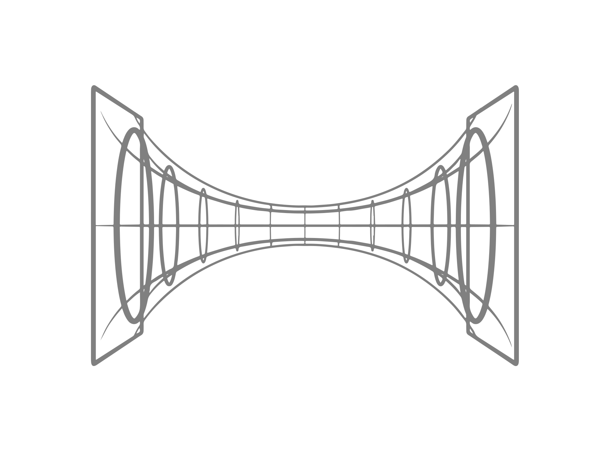

|logo| ``tractor``: distributed structured concurrency

``tractor`` is a `structured concurrency`_ (SC), multi-processing_ runtime built on trio_.

Fundamentally, ``tractor`` provides parallelism via
``trio``-"*actors*": independent Python **processes** (i.e.
*non-shared-memory threads*) which can schedule ``trio`` tasks whilst
maintaining *end-to-end SC* inside a *distributed supervision tree*.

Cross-process (and thus cross-host) SC is accomplished through the
combined use of our,

- "actor nurseries_" which provide for spawning multiple, and
  possibly nested, Python processes each running a ``trio`` scheduled
  runtime - a call to ``trio.run()``,
- an "SC-transitive supervision protocol" enforced as an
  IPC-message-spec encapsulating all RPC-dialogs.

We believe the system adheres to the `3 axioms`_ of an "`actor model`_"
but likely **does not** look like what **you** probably *think* an "actor
model" looks like, and that's **intentional**.

Where do i start!?
------------------
New to ``trio`` and **structured concurrency**? Our docs collect the
best starting points and then walk you straight into a hands-on
quickstart:

  https://goodboy.github.io/tractor/start/quickstart.html

Features
--------
- **It's just** a ``trio`` API!
- *Infinitely nesteable* process trees running embedded ``trio`` tasks.
- Swappable, OS-specific, process spawning via multiple backends.
- Modular IPC stack, allowing for custom interchange formats (eg.
  as offered from `msgspec`_), varied transport protocols (TCP, RUDP,
  QUIC, wireguard), and OS-env specific higher-perf primitives (UDS,
  shm-ring-buffers).
- Optionally distributed_: all IPC and RPC APIs work over multi-host
  transports the same as local.
- Builtin high-level streaming API that enables your app to easily
  leverage the benefits of a "`cheap or nasty`_" `(un)protocol`_.
- A "native UX" around a multi-process safe debugger REPL using
  `pdbp`_ (a fork & fix of `pdb++`_)
- "Infected ``asyncio``" mode: support for starting an actor's
  runtime as a `guest`_ on the ``asyncio`` loop allowing us to
  provide stringent SC-style ``trio.Task``-supervision around any
  ``asyncio.Task`` spawned via our ``tractor.to_asyncio`` APIs.
- A **very naive** and still very much work-in-progress inter-actor
  `discovery`_ sys with plans to support multiple `modern protocol`_
  approaches.
- Various ``trio`` extension APIs via ``tractor.trionics`` such as,

  - task fan-out `broadcasting`_,
  - multi-task-single-resource-caching and fan-out-to-multi
    ``__aenter__()`` APIs for ``@acm`` functions,
  - (WIP) a ``TaskMngr``: one-cancels-one style nursery supervisor.

Status of `main` / infra
------------------------

- |gh_actions|
- |docs|

Install
-------
``tractor`` is still in a *alpha-near-beta-stage* for many
of its subsystems, however we are very close to having a stable
lowlevel runtime and API.

As such, it's currently recommended that you clone and install the
repo from source::

    pip install git+git://github.com/goodboy/tractor.git

We use the very hip `uv`_ for project mgmt::

    git clone https://github.com/goodboy/tractor.git
    cd tractor
    uv sync --dev
    uv run python examples/rpc_bidir_streaming.py

Consider activating a virtual/project-env before starting to hack on
the code base::

    # you could use plain ol' venvs
    # https://docs.astral.sh/uv/pip/environments/
    uv venv tractor_py313 --python 3.13

    # but @goodboy prefers the more explicit (and shell agnostic)
    # https://docs.astral.sh/uv/configuration/environment/#uv_project_environment
    UV_PROJECT_ENVIRONMENT="tractor_py313"

    # hint hint, enter @goodboy's fave shell B)
    uv run --dev xonsh

Alongside all this we ofc offer "releases" on PyPi::

    pip install tractor

Just note that YMMV since the main git branch is often much further
ahead then any latest release.

Hacking on the docs themselves? The build + live-preview one-liners
(incl. nix-shell specifics) are collected in `notes_to_self/howtodocs.md
<https://github.com/goodboy/tractor/blob/main/notes_to_self/howtodocs.md>`_,
and rendered as the "Building these docs" section of our dev-tips guide.

Example codez
-------------
We prefer to point you at the runnable scripts under ``examples/``
- each is CI-run and ``literalinclude``-d straight into the docs, so
what you read there is what actually runs - rather than inline a
pile of them here. The one-minute pitch: spawn a subactor per core,
open a ``Context`` into each, then crash the root *on purpose* and
watch the runtime reap the whole tree - zero zombies, guaranteed (if
you can make a zombie child without a system signal, it **is a
bug**).

See it run - plus the full tour (the flagship multi-process
debugger, bidirectional streaming over a ``Context``, cancellation,
discovery, "infected ``asyncio``", typed messaging and worker-pool /
cluster patterns) - in the docs:

- docs: https://goodboy.github.io/tractor/
- examples: https://github.com/goodboy/tractor/tree/main/examples

Under the hood
--------------
``tractor`` is an attempt to pair trionic_ `structured concurrency`_ with
distributed Python. You can think of it as a ``trio``
*-across-processes* or simply as an opinionated replacement for the
stdlib's ``multiprocessing`` but built on async programming primitives
from the ground up.

Don't be scared off by this description. ``tractor`` **is just** ``trio``
but with nurseries for process management and cancel-able streaming IPC.
If you understand how to work with ``trio``, ``tractor`` will give you
the parallelism you may have been needing.

Wait, huh?! I thought "actors" have messages, and mailboxes and stuff?!
***********************************************************************
Let's stop and ask how many canon actor model papers have you actually read ;)

From our experience many "actor systems" aren't really "actor models"
since they **don't adhere** to the `3 axioms`_ and pay even less
attention to the problem of *unbounded non-determinism* (which was the
whole point for creation of the model in the first place).

From the author's mouth, **the only thing required** is `adherance to`_
the `3 axioms`_, *and that's it*.

``tractor`` adheres to said base requirements of an "actor model"::

    In response to a message, an actor may:

    - send a finite number of new messages
    - create a finite number of new actors
    - designate a new behavior to process subsequent messages

**and** requires *no further api changes* to accomplish this.

If you want do debate this further please feel free to chime in on our
chat or discuss on one of the following issues *after you've read
everything in them*:

- https://github.com/goodboy/tractor/issues/210
- https://github.com/goodboy/tractor/issues/18

Let's clarify our parlance
**************************
Whether or not ``tractor`` has "actors" underneath should be mostly
irrelevant to users other then for referring to the interactions of our
primary runtime primitives: each Python process + ``trio.run()``
+ surrounding IPC machinery. These are our high level, base
*runtime-units-of-abstraction* which both *are* (as much as they can
be in Python) and will be referred to as our *"actors"*.

The main goal of ``tractor`` is is to allow for highly distributed
software that, through the adherence to *structured concurrency*,
results in systems which fail in predictable, recoverable and maybe even
understandable ways; being an "actor model" is just one way to describe
properties of the system.

What's on the TODO
------------------
The roadmap lives with our docs - see `what the future holds
<https://goodboy.github.io/tractor/project/index.html#what-the-future-holds>`_
for where ``tractor`` is headed.

Feel like saying hi?
--------------------
This project is very much coupled to the ongoing development of
``trio`` (i.e. ``tractor`` gets most of its ideas from that brilliant
community). If you want to help, have suggestions or just want to
say hi, please feel free to reach us in our `matrix channel`_.  If
matrix seems too hip, we're also mostly all in the the `trio gitter
channel`_!

.. _distributed: https://en.wikipedia.org/wiki/Distributed_computing
.. _multi-processing: https://en.wikipedia.org/wiki/Multiprocessing
.. _trio: https://github.com/python-trio/trio
.. _nurseries: https://vorpus.org/blog/notes-on-structured-concurrency-or-go-statement-considered-harmful/#nurseries-a-structured-replacement-for-go-statements
.. _actor model: https://en.wikipedia.org/wiki/Actor_model
.. _trionic: https://trio.readthedocs.io/en/latest/design.html#high-level-design-principles
.. _3 axioms: https://www.youtube.com/watch?v=7erJ1DV_Tlo&t=162s
.. .. _3 axioms: https://en.wikipedia.org/wiki/Actor_model#Fundamental_concepts
.. _adherance to: https://www.youtube.com/watch?v=7erJ1DV_Tlo&t=1821s
.. _trio gitter channel: https://gitter.im/python-trio/general
.. _matrix channel: https://matrix.to/#/!tractor:matrix.org
.. _broadcasting: https://github.com/goodboy/tractor/pull/229
.. _pdbp: https://github.com/mdmintz/pdbp
.. _pdb++: https://github.com/pdbpp/pdbpp
.. _cheap or nasty: https://zguide.zeromq.org/docs/chapter7/#The-Cheap-or-Nasty-Pattern
.. _(un)protocol: https://zguide.zeromq.org/docs/chapter7/#Unprotocols
.. _discovery: https://zguide.zeromq.org/docs/chapter8/#Discovery
.. _modern protocol: https://en.wikipedia.org/wiki/Rendezvous_protocol
.. _structured concurrency: https://en.wikipedia.org/wiki/Structured_concurrency
.. _uv: https://docs.astral.sh/uv/
.. _msgspec: https://jcristharif.com/msgspec/
.. _guest: https://trio.readthedocs.io/en/stable/reference-lowlevel.html?highlight=guest%20mode#using-guest-mode-to-run-trio-on-top-of-other-event-loops

..
   NOTE, on generating badge links from the UI
   https://docs.github.com/en/actions/how-tos/monitoring-and-troubleshooting-workflows/monitoring-workflows/adding-a-workflow-status-badge?ref=gitguardian-blog-automated-secrets-detection#using-the-ui
.. |gh_actions| image:: https://github.com/goodboy/tractor/actions/workflows/ci.yml/badge.svg?branch=main
    :target: https://github.com/goodboy/tractor/actions/workflows/ci.yml

.. |docs| image:: https://github.com/goodboy/tractor/actions/workflows/docs.yml/badge.svg?branch=main
    :target: https://goodboy.github.io/tractor/
    :alt: Documentation

